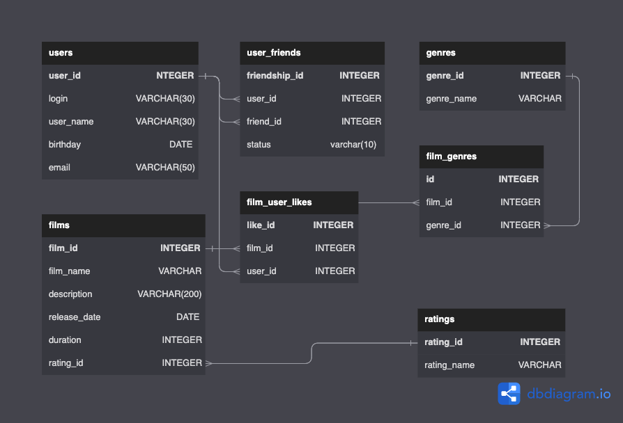

# Filmorate

Filmorate - это бекенд-приложение, которое предназначено для обработки и хранения данных о пользователях и их любимых фильмах. Оно является частью учебного проекта, выполненного в рамках курса на Яндекс.Практикуме.

## Установка и настройка

Для установки и настройки приложения Filmorate вам потребуется:

1. Установить необходимые зависимости и инструменты для разработки.
2. Создать базу данных и настроить подключение к базе данных в конфигурационном файле.
3. Запустить приложение.

## Использование

Filmorate предоставляет следующие функциональные возможности:

- Добавление и обновление информации о фильмах.
- Получение списка всех фильмов или фильма по его идентификатору.
- Добавление и удаление лайков к фильмам.
- Получение списка популярных фильмов.
- Работа с пользователями: создание, обновление, получение информации о пользователе, добавление и удаление друзей, получение общих друзей.

## База данных

Filmorate использует следующую схему базы данных:

- Таблица `users` для хранения информации о пользователях.
- Таблица `user_friends` для хранения связей между пользователями в качестве друзей.
- Таблица `genres` для хранения информации о жанрах фильмов.
- Таблица `ratings` для хранения информации о рейтингах фильмов.
- Таблица `films` для хранения информации о фильмах.
- Таблица `film_user_likes` для хранения информации о лайках пользователей к фильмам.
- Таблица `film_genres` для связи фильмов с жанрами.

